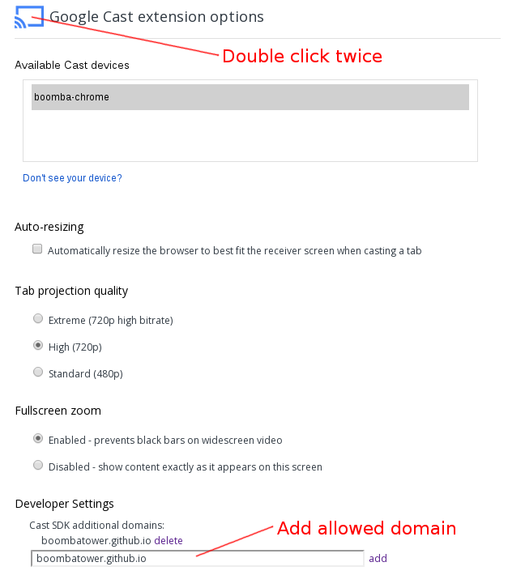
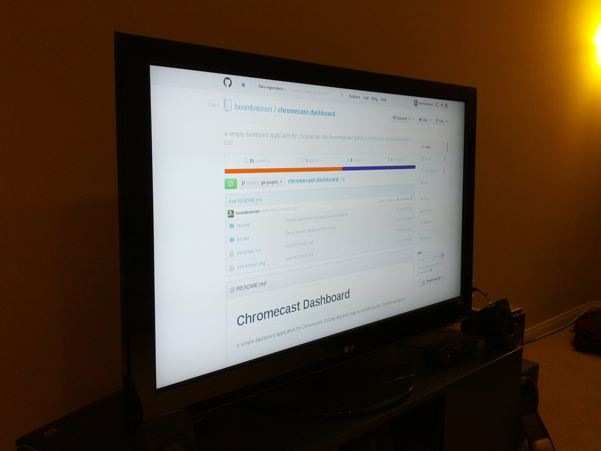

# Description #

A simple dashboard application for Chromecast. Display any web page accessible
by the Chromecast device.

# Whitelist domain #

Currently, all applications need to be whitelisted in the Chromecast extension.

1. Right-click on the Chromecast extension icon (cast symbol) and select Options
1. Double click twice (four clicks) on the Cast symbol on the Options page
1. Add the `boombatower.github.io` as an additional domain (see screenshot)

# Usage #

Visit the following Url for the sender portion of the application.

http://boombatower.github.io/chromecast-dashboard/sender/

# Enjoy! #

[StatCounter stats](http://statcounter.com/p9400224/summary/?guest=1)
